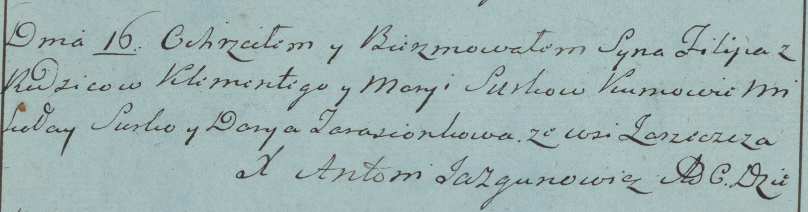

**Сушко Филипп Клеменсов (Suszko Filip)**

16 октября 1782г -- крещение сына Филиппа (РГИА 823-2-18, лист 222об,
№8/1782-р (коп)).

**РГИА 823-2-18:** Лист 222об. **Метрическая запись №8/1782-р (коп).**

{width="6.496527777777778in"
height="1.7104166666666667in"}

Дедиловичская Покровская церковь. 16 октября 1782 года. Метрическая
запись о крещении.

Suszko Filip -- сын родителей с деревни Заречье.

Suszko Klementy -- отец.

Suszkowa Marya -- мать.

Suszko Mikołay -- кум.

Tarasionkowa Darya - кума.

Jazgunowicz Antoni -- ксёндз.
