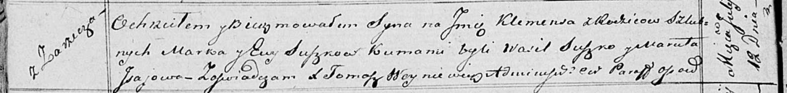

**Сушко Ева (Suszkowa Ewa)**

12 июля 1819 г -- крещение сына Клеменса (НИАБ 136-13-894, лист 101об,
№36/1819-р (ориг)).

**НИАБ 136-13-894:** Лист 101об. **Метрическая запись №36/1819-р
(ориг).**

{width="6.496527777777778in"
height="0.7737631233595801in"}

Осовская Покровская церковь. 12 июля 1819 года. Метрическая запись о
крещении.

Suszko Klemens -- сын родителей с деревни Заречье.

Suszko Marko -- отец.

Suszkowa Ewa -- мать.

Suszko Wasil -- кум.

Jsajowa Maruta -- кума.

Woyniewicz Tomasz -- ксёндз.
