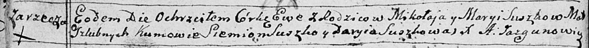

**Сушко Ева Миколаева (Suszkowna Ewa)**

16 ноября 1791 г -- крещение (НИАБ 136-13-894, лист 14об, №58/1791-р
(ориг)).

**НИАБ 136-13-894:** Лист 14-об. **Метрическая запись №58/1791-р
(ориг).**

{width="6.496527777777778in"
height="0.5431091426071741in"}

Дедиловичская Покровская церковь. 16 ноября 1791 года. Метрическая
запись о крещении.

Suszkowna Ewa -- дочь родителей с деревни Заречье.

Suszko Mikołay -- отец.

Suszkowa Maryia -- мать.

Suszko Siemion - кум.

Suszkowa Daryia - кума.

Jazgunowicz Antoni -- ксёндз.
