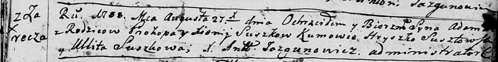
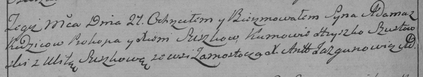

**Сушко Адам Прокопов (Suszko Adam)**

27 августа 1788 г -- крещение (НИАБ 136-13-894, лист 5, №43/1788-р
(ориг)), (РГИА 823-2-18, лист 236об, №23/1788-р (коп)).

**НИАБ 136-13-894:** Лист 5. **Метрическая запись №43/1788-р (ориг).**

Дедиловичская Покровская церковь. 27 августа 1788 года. Метрическая
запись о крещении.

Suszko Adam -- сын родителей с деревни Заречье.

Suszko Prokop -- отец.

Suszkowa Xienija -- мать.

Susztowski Hryszko - кум.

Suszkowa Ullita - кума.

Jazgunowicz Antoni -- ксёндз.

**РГИА 823-2-18:** Лист 236об. **Метрическая запись №23/1788-р (коп).**

Дедиловичская Покровская церковь. 27 августа 1788 года. Метрическая
запись о крещении.

Suszko Adam -- сын родителей с деревни Замосточье \[Заречье\].

Suszko Prokop -- отец.

Suszkowa Xienia -- мать.

Szustowski Hryszko -- кум.

Suszkowa Ulita - кума.

Jazgunowicz Antoni -- ксёндз.
