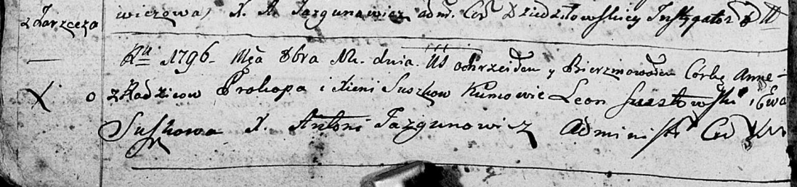

**Сушко Анна Прокопова (Suszkowna Anna)**

12 октября 1796 г -- крещение (НИАБ 136-13-894, лист 30об, №85/1796-р
(ориг)).

**НИАБ 136-13-894:** Лист 30-об. **Метрическая запись №85/1796-р
(ориг).**

Дедиловичская Покровская церковь. 12 октября 1796 года. Метрическая
запись о крещении.

Suszkowna Anna -- дочь родителей с деревни Заречье.

Suszko Prokop -- отец.

Suszkowa Xienia -- мать.

Szustowski Leon -- кум.

Suszkowa Ewa - кума.

Jazgunowicz Antoni -- ксёндз.
