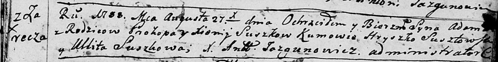

**Сушко Габриэль Прокопов (Suszko Gabriel Antoni)**

1 апреля 1803 г -- крещение (НИАБ 136-13-894, лист 50, №10/1803-р
(ориг)).

**НИАБ 136-13-894:** Лист 5. **Метрическая запись №43/1788-р (ориг).**

Дедиловичская Покровская церковь. 27 августа 1788 года. Метрическая
запись о крещении.

Suszko Adam -- сын родителей с деревни Заречье.

Suszko Prokop -- отец.

Suszkowa Xienija -- мать.

Susztowski Hryszko - кум.

Suszkowa Ullita - кума.

Jazgunowicz Antoni -- ксёндз.

**НИАБ 136-13-894:** Лист 9об. **Метрическая запись №32/1790-р (ориг).**

Дедиловичская Покровская церковь. 2 июня 1790 года. Метрическая запись о
крещении.

Suszko Mikita -- сын родителей с деревни Заречье.

Suszko Prokop -- отец.

Suszkowa Xienija -- мать.

Szustowski Hryszko - кум.

Suszkowa Ullyta - кума.

Jazgunowicz Antoni -- ксёндз.

**НИАБ 136-13-894:** Лист 15об. **Метрическая запись №19/1792-р
(ориг).**

Дедиловичская Покровская церковь. 21 марта 1792 года. Метрическая запись
о крещении.

Suszkowna Justyna -- дочь родителей с деревни Заречье.

Suszko Prokop -- отец.

Suszkowa Xienia -- мать.

Szustowski Hryszka - кум.

Szuszkowa Ewa - кума.

Jazgunowicz Antoni -- ксёндз.

**НИАБ 136-13-894:** Лист 22. **Метрическая запись №20/1794-р (ориг).**

Дедиловичская Покровская церковь. 9 апреля 1794 года. Метрическая запись
о крещении.

Suszkowna Elżbieta -- дочь родителей с деревни Заречье.

Suszko Prokop -- отец.

Suszkowa Xienia -- мать.

Szutowski Hryszko - кум.

Suszkowa Ewa - кума.

Jazgunowicz Antoni -- ксёндз.

**НИАБ 136-13-894:** Лист 30-об. **Метрическая запись №85/1796-р
(ориг).**

Дедиловичская Покровская церковь. 12 октября 1796 года. Метрическая
запись о крещении.

Suszkowna Anna -- дочь родителей с деревни Заречье.

Suszko Prokop -- отец.

Suszkowa Xienia -- мать.

Szustowski Leon -- кум.

Suszkowa Ewa - кума.

Jazgunowicz Antoni -- ксёндз.

**НИАБ 136-13-894:** Лист 39. **Метрическая запись №30/1799-р (ориг).**

Дедиловичская Покровская церковь. 16 июля 1799 года. Метрическая запись
о крещении.

Suszko Eliasz -- сын родителей с деревни Заречье.

Suszko Prokop -- отец.

Suszkowa Xienia -- мать.

Susztowski Leon -- кум.

Suszkowa Ewa -- кума.

Jazgunowicz Antoni -- ксёндз.

**НИАБ 136-13-894:** Лист 50. **Метрическая запись №10/1803-р (ориг).**

Дедиловичская Покровская церковь. 1 апреля 1803 года. Метрическая запись
о крещении.

Suszko Gabriel Antoni -- сын родителей с деревни Заречье.

Suszko Prokop -- отец.

Suszkowa Xienia -- мать.

Warawicz Karp -- кум, с деревни Пядaнь.

Suszkowa Ewa -- кума, с деревни Заречье.

Jazgunowicz Antoni -- ксёндз.
