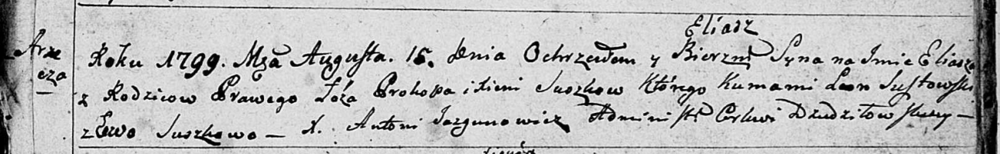
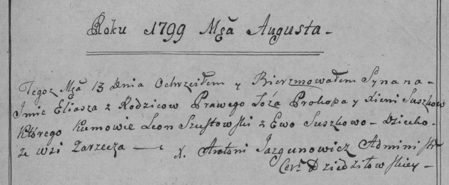
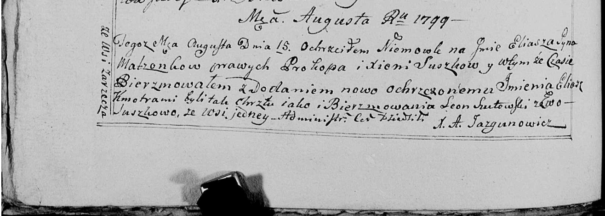

**Сушко Илья Прокопов (Suszko Eliasz Eliasz)**

16 августа 1799 г -- крещение (НИАБ 136-13-894, лист 39, №30/1799-р
(ориг), РГИА 823-2-18, лист 271, №29/1799-р (коп), НИАБ 136-13-938, лист
242об, №28/1799-р (коп)).

**НИАБ 136-13-894:** Лист 39. **Метрическая запись №30/1799-р (ориг).**

Дедиловичская Покровская церковь. 16 августа 1799 года. Метрическая
запись о крещении.

Suszko Eliasz -- сын родителей с деревни Заречье.

Suszko Prokop -- отец.

Suszkowa Xienia -- мать.

Susztowski Leon -- кум.

Suszkowa Ewa -- кума.

Jazgunowicz Antoni -- ксёндз.

**РГИА 823-2-18:** Лист 271. **Метрическая запись №29/1799-р (коп).**

Дедиловичская Покровская церковь. \[16\] августа 1799 года. Метрическая
запись о крещении.

Suszko Eliasz -- сын родителей с деревни Заречье.

Suszko Prokop -- отец.

Suszkowa Xienia -- мать.

Szustowski Leon -- кум.

Suszkowa Ewa -- кума.

Jazgunowicz Antoni -- ксёндз.

**НИАБ 136-13-938:** Лист 242об. **Метрическая запись №28/1799-р
(коп).**

(См. тж. НИАБ 136-13-894, лист 39, №30/1799-р (ориг); РГИА 823-2-18,
лист 271, №29/1799-р (коп))

Дедиловичская Покровская церковь. 15 августа 1799 года. Метрическая
запись о крещении.

Suszko Eliasz Eliasz -- сын родителей с деревни Заречье.

Suszko Prokop -- отец.

Suszkowa Xienia -- мать.

Szutowski Leon -- кум, с деревни Заречье.

Suszkowa Ewa - кума, с деревни Заречье.

Jazgunowicz Antoni -- ксёндз.
