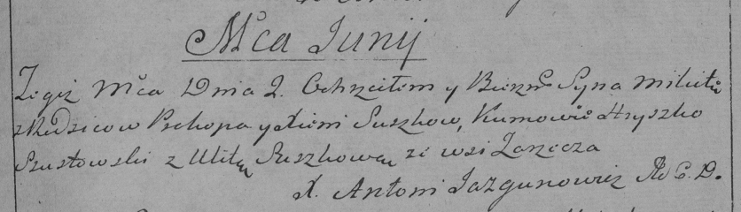

**Сушко Микита Прокопов (Suszko Mikita)**

2 июня 1790 г -- крещение (НИАБ 136-13-894, лист 9об, №32/1790-р
(ориг)), (РГИА 823-2-18, лист 240, №16/1790-р (коп)).

**НИАБ 136-13-894:** Лист 9об. **Метрическая запись №32/1790-р (ориг).**

{width="6.496527777777778in"
height="0.9132283464566929in"}

Дедиловичская Покровская церковь. 2 июня 1790 года. Метрическая запись о
крещении.

Suszko Mikita -- сын родителей с деревни Заречье.

Suszko Prokop -- отец.

Suszkowa Xienija -- мать.

Szustowski Hryszko - кум.

Suszkowa Ullyta - кума.

Jazgunowicz Antoni -- ксёндз.

**РГИА 823-2-18:** Лист 240. **Метрическая запись №16/1790-р (коп).**

{width="6.496527777777778in"
height="1.8652777777777778in"}

Дедиловичская Покровская церковь. 2 июня 1790 года. Метрическая запись о
крещении.

Suszko Mikita -- сын родителей с деревни Заречье.

Suszko Prokop -- отец.

Suszkowa Xienia -- мать.

Szustowski Hryszko -- кум.

Suszkowa Ulita - кума.

Jazgunowicz Antoni -- ксёндз.
