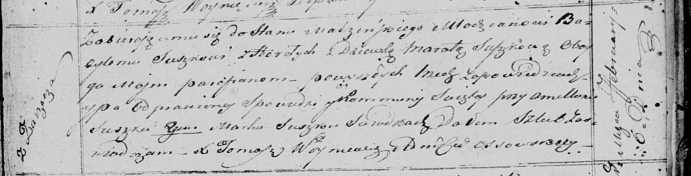

**Сушко (в девичестве Сушко) Марата (Suszkowa Marata z Suszkow)**

6 января 1821 г -- венчание с молодым Базылём Сушко с деревни Горелое
(НИАБ 136-13-920, лист 28, №2/1821-р (ориг)).

**НИАБ 136-13-920:** Лист 28. **Метрическая запись №2/1821-б (ориг).**

{width="6.496527777777778in"
height="1.662853237095363in"}

Осовская Покровская церковь. 6 января 1821 года. Запись о венчании.

Suszko Bazyl -- жених, молодой, парафии Осовской, с деревни Горелое.

Suszkowa Marata -- невеста, девка, парафии Осовской, с деревни Заречье.

Suszko Amillan -- свидетель.

Suszko Mark -- свидетель.

Woyniewicz Tomasz -- ксёндз.
