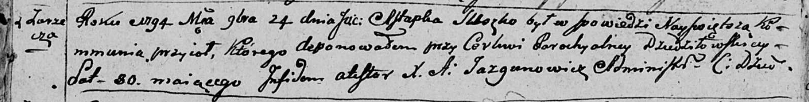

**Сушко Астапка (Suszko Astapka)**

24 ноября 1794 г -- отпевание, умер в возрасте 80 лет (родился около
1714 г) (НИАБ 136-13-919, лист 3об, №60/1794-у (ориг)).

**НИАБ 136-13-919:** Лист 3об. **Метрическая запись №60/1794-у (ориг).**

Дедиловичская Покровская церковь. 24 ноября 1794 года. Метрическая
запись об отпевании.

Suszko Astapka -- умерший, 80 лет, с деревни Заречье, похоронен на
кладбище при церкви Дедиловичской.

Jazgunowicz Antoni -- ксёндз.
