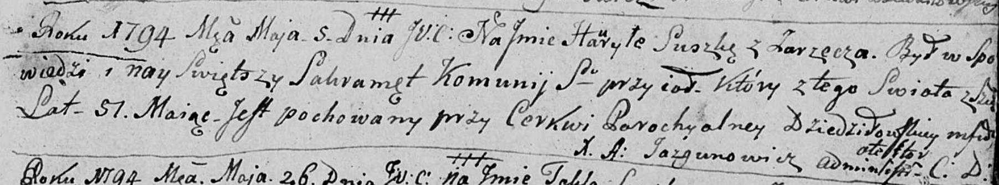

**Сушко Гаврыла (Suszko Hauryła)**

5 мая 1794 г -- отпевание, умер в возрасте 51 год (родился около 1743 г)
(НИАБ 136-13-919, лист 2, №23/1794-у (ориг)).

**НИАБ 136-13-919:** Лист 2. **Метрическая запись №23/1794-у (ориг).**

Дедиловичская Покровская церковь. 5 мая 1794 года. Метрическая запись об
отпевании.

Suszko Hauryła -- умерший, 51 год, с деревни Заречье, похоронен при
церкви Дедиловичской.

Jazgunowicz Antoni -- ксёндз.
