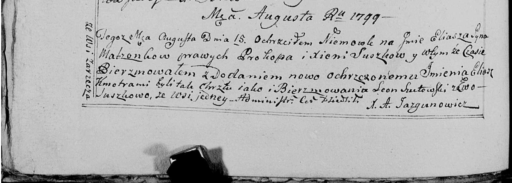

**Сушко Ева (Suszkowa Ewa)**

16 августа 1799 г -- крестная мать Ильи, сына Сушков Прокопа и Ксени с
деревни Заречье (НИАБ 136-13-938, лист 242об, №28/1799-р (коп)).

**НИАБ 136-13-938:** Лист 242об. **Метрическая запись №28/1799-р
(коп).**

(См. тж. НИАБ 136-13-894, лист 39, №30/1799-р (ориг); РГИА 823-2-18,
лист 271, №29/1799-р (коп))

{width="6.496527777777778in"
height="2.325in"}

Дедиловичская Покровская церковь. 15 августа 1799 года. Метрическая
запись о крещении.

Suszko Eliasz Eliasz -- сын родителей с деревни Заречье.

Suszko Prokop -- отец.

Suszkowa Xienia -- мать.

Szutowski Leon -- кум, с деревни Заречье.

Suszkowa Ewa - кума, с деревни Заречье.

Jazgunowicz Antoni -- ксёндз.
