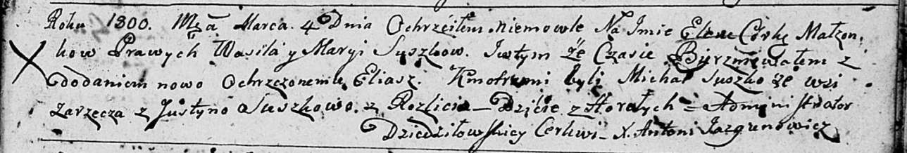
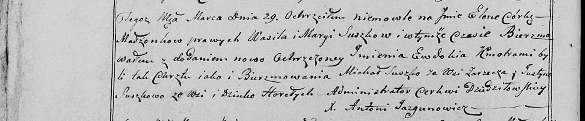

**Сушко Михал (Suszko Michał)**

4 марта 1800 г -- крестный отец Елены Елиаш, дочери Сушков Василя и
Марины с деревни Горелое (НИАБ 136-13-894, лист 41, №10/1800-р (ориг),
НИАБ 136-13-949, лист 101об, №10/1800-р (коп)).

**НИАБ 136-13-894:** Лист 41. **Метрическая запись №10/1800-р (ориг).**

Дедиловичская Покровская церковь. 4 марта 1800 года. Метрическая запись
о крещении.

Suszkowna Elena Eliasz (?) -- дочь родителей с деревни Горелое.

Suszko Wasil -- отец.

Suszkowa Maryia -- мать.

Suszko Michał -- кум, с деревни Заречье.

Suszkowa Justyna -- кума, с деревни Разлитье.

Jazgunowicz Antoni -- ксёндз.

**НИАБ 136-13-949:** Лист 101об. **Метрическая запись №10/1800-р
(коп).**

(См. тж.: РГИА 823-2-18, лист 275, №10/1800-р (коп), НИАБ 136-13-894,
лист 41, №10/1800-р (ориг))

Дедиловичская Покровская церковь. 29 марта 1800 года. Метрическая запись
о крещении.

Suszkowna Elena Ewdokia -- дочь родителей с деревни Горелое.

Suszko Wasil -- отец.

Suszkowa Marya -- мать.

Suszko Michał -- кум, с деревни Заречье.

Suszkowa Justyna - кума, с деревни Горелое \[Разлитье\].

Jazgunowicz Antoni -- ксёндз.
