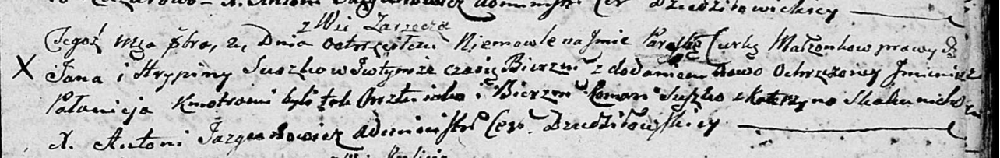

**Сушко Параска Янова (Suszkowna Paraska Pałanieja)**

2 октября 1804 г -- крещение (НИАБ 136-13-894, лист 55, №42/1804-р
(ориг)).

**НИАБ 136-13-894:** Лист 55. **Метрическая запись №42/1804-р (ориг).**

Дедиловичская Покровская церковь. 2 октября 1804 года. Метрическая
запись о крещении.

Suszkowna Paraska Pałanieja -- дочь родителей с деревни Заречье.

Suszko Jan -- отец.

Suszkowa Hrypina -- мать.

Suszko Roman -- кум.

Skakunicha Katerzyna -- кума.

Jazgunowicz Antoni -- ксёндз.
