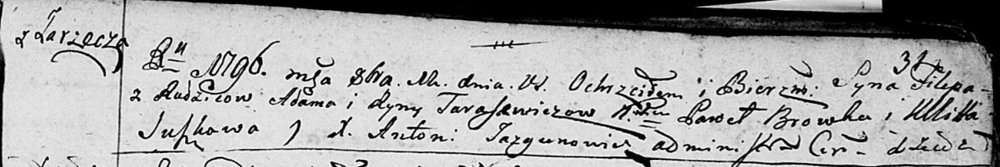

**Тарасевич Филип Адамов (Tarasewicz Filip)**

12 октября 1796 г -- крещение (НИАБ 136-13-894, лист 31, №86/1796-р
(ориг)), (РГИА 823-2-18, лист 257об, №50/1796-р (коп)).

**НИАБ 136-13-894:** Лист 31. **Метрическая запись №86/1796-р (ориг).**

Дедиловичская Покровская церковь. 12 октября 1796 года. Метрическая
запись о крещении.

Tarasewicz Filip -- сын родителей с деревни Заречье.

Tarasewicz Adam -- отец.

Tarasewiczowa Ryna -- мать.

Browka Paweł -- кум.

Suszkowa Ullita - кума.

Jazgunowicz Antoni -- ксёндз.

**РГИА 823-2-18:** Лист 257об. **Метрическая запись №50/1796-р (коп).**

Дедиловичская Покровская церковь. 12 октября 1796 года. Метрическая
запись о крещении.

Tarasewicz Filip -- сын родителей с деревни Заречье.

Tarasewicz Adam -- отец.

Tarasewiczowa Jryna -- мать.

Browka Paweł -- кум.

Suszkowa Ulita -- кума.

Jazgunowicz Antoni -- ксёндз.
