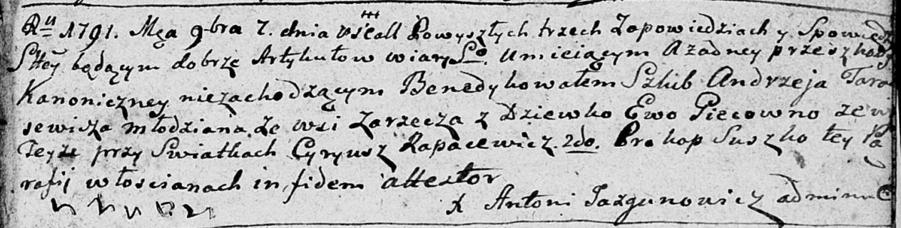

**Тарасевич (Пец) Андрей (Tarasewiczowa Ewa z Piecow)**

7 сентября 1791 г -- венчание с Андреем Тарасевичем с деревни Заречье
(НИАБ 136-13-894, лист 70, №14/1791-б (ориг)).

**НИАБ 136-13-894:** Лист 70. **Метрическая запись №14/1791-б (ориг).**

{width="6.496527777777778in"
height="1.646091426071741in"}

Дедиловичская Покровская церковь. 7 сентября 1791 года. Метрическая
запись о венчании.

Tarasewicz Andrzey -- жених, с деревни Заречье.

Piecowna Ewa -- невеста, с деревни Заречье.

Rapacewicz Cyryusz -- свидетель.

Suszko Prokop -- свидетель.

Suszko Sciepan -- свидетель.

Jazgunowicz Antoni -- ксёндз.
