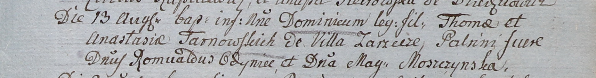

**Тарновский Доминик Томашов (Tarnowski Dominic)**

13 августа 1805 г -- крещение (НИАБ 937-4-32, лист 12, №30/1805-р).

**НИАБ 937-4-32:** Лист 12. **Метрическая запись №30/1805-р.**

Дедиловичский костел Наисвятейшего Сердца Иисуса. 13 августа 1805 года.
Метрическая запись о крещении.

Tarnowski Dominic -- сын родителей с деревни Заречье.

Tarnowski Thoma -- отец.

Tarnowska Anastasia -- мать.

Odyniec Romuald -- крестный отец, шляхтич.

Moszczynska Magdalena -- крестная мать, шляхтянка.

Linhart Hiacinthus -- ксёндз.
