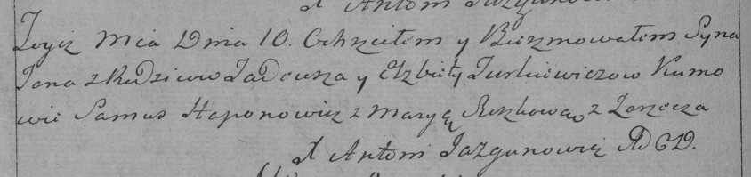

**Туркевич Тадей (Turkiewicz Tadeusz)**

10 марта 1787 г -- крещение сына Яна (НИАБ 136-13-894, лист 9,
№17/1790-р (ориг)), (РГИА 823-2-18, лист 239об, №10/1790-р (коп)).

**НИАБ 136-13-894:** Лист 9. **Метрическая запись №17/1790-р (ориг).**

{width="6.496527777777778in"
height="0.890430883639545in"}

Дедиловичская Покровская церковь. 10 марта 1790 года. Метрическая запись
о крещении.

Turkiewicz Jan -- сын родителей с деревни Заречье.

Turkiewicz Tadeusz -- отец.

Turkiewiczowa Elżbieta -- мать.

Hapanowicz Samuś - кум.

Suszkowa Marya - кума.

Jazgunowicz Antonij -- ксёндз.

**РГИА 823-2-18:** Лист 239об. **Метрическая запись №10/1790-р (коп).**

{width="6.496527777777778in"
height="1.5319444444444446in"}

Дедиловичская Покровская церковь. 10 марта 1790 года. Метрическая запись
о крещении.

Turkiewicz Jan -- сын родителей с деревни Заречье.

Turkiewicz Tadeusz -- отец.

Turkiewiczowa Elżbieta -- мать.

Haponowicz Samus -- кум.

Suszkowa Marya - кума.

Jazgunowicz Antoni -- ксёндз.
