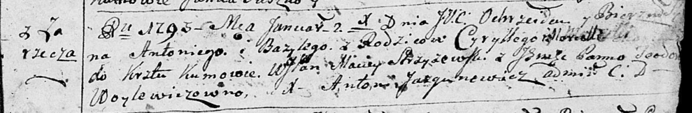

**Уконский Антон Цырыльев (Ukonski Antoni Bazyli)**

2 января 1793 г -- крещение (НИАБ 136-13-894, лист 18, №2/1793-р
(ориг)), (РГИА 823-2-18, лист 246, №2/1793-р (коп)).

**НИАБ 136-13-894:** Лист 18. **Метрическая запись №2/1793-р (ориг).**

Дедиловичская Покровская церковь. 2 января 1793 года. Метрическая запись
о крещении.

Antoni Bazyli -- сын родителей с деревни Заречье.

Cyrylli -- отец.

Marcella -- мать.

Strzyzewski Maciey, WJP -- кум, шляхтич.

Woylewiczowna Teodora, JP -- кума, шляхтянка.

Jazgunowicz Antoni -- ксёндз.

**РГИА 823-2-18:** Лист 246. **Метрическая запись №2/1793-р (коп).**

Дедиловичская Покровская церковь. 2 января 1793 года. Метрическая запись
о крещении.

Ukonski Antoni -- сын родителей с деревни Заречье.

Ukonski Cyrylli -- отец.

Ukonska Marcella -- мать.

Strzyzewski Maciey -- кум.

Woytkiewiczowna Teodora, JP -- кума, шляхтянка.

Jazgunowicz Antoni -- ксёндз.
