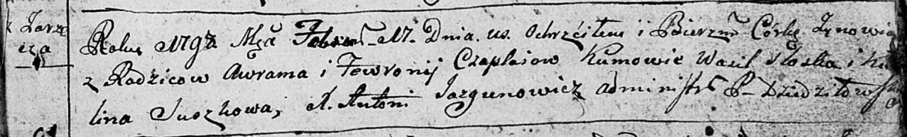
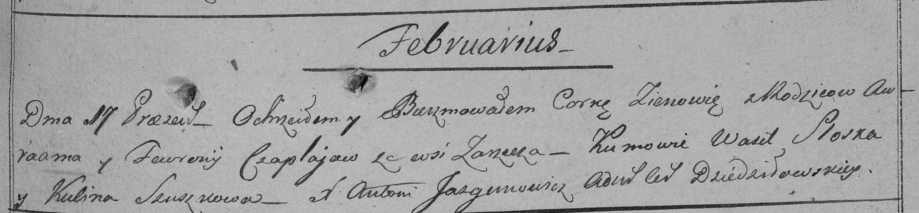
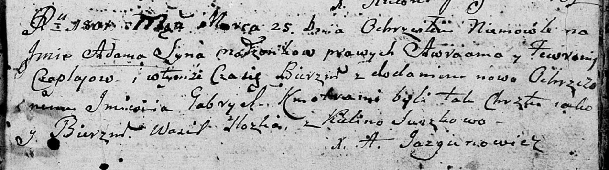

**Чапляй Аврам (Czaplay Awram, Awraam, Abraham)**

17 февраля 1798 г -- крещение дочери Зыновии (НИАБ 136-13-894, лист 35,
№6/1798-р (ориг)), (РГИА 823-2-18, лист 262, №6/1798-р (коп)).

25 марта 1801 г -- крещение сына Адама Габриэля (НИАБ 136-13-894, лист
43, №9/1801-р (ориг)).

1 января 1806 г -- крещение дочери Маланьи (НИАБ 136-13-894, лист 59,
№1/1806-р (ориг)).

1 июля 1808 г -- крещение сына Петра (НИАБ 136-13-894, лист 65об,
№23/1808-р (ориг)).

**НИАБ 136-13-894:** Лист 35. **Метрическая запись №6/1798-р (ориг).**

Дедиловичская Покровская церковь. 17 февраля 1798 года. Метрическая
запись о крещении.

Czaplaiowna Zynowija -- дочь родителей с деревни Заречье.

Czaplay Awram -- отец.

Czaplaiowa Fewronija -- мать.

Sloska Wasil - кум.

Suszkowa Kulina - кума.

Jazgunowicz Antoni -- ксёндз.

**РГИА 823-2-18:** Лист 262. **Метрическая запись №6/1798-р (коп).**

Дедиловичская Покровская церковь. 17 февраля 1798 года. Метрическая
запись о крещении.

Czaplajowna Zienowia -- дочь родителей с деревни Заречье.

Czaplay Awraam -- отец.

Czaplajowa Fewronija -- мать.

Sloska Wasil -- кум.

Szuszkowa Kulina -- кума.

Jazgunowicz Antoni -- ксёндз.

**НИАБ 136-13-894:** Лист 43. **Метрическая запись №9/1801-р (ориг).**

Дедиловичская Покровская церковь. 25 марта 1801 года. Метрическая запись
о крещении.

Czaplay Adam Gabriel -- сын родителей \[с деревни Заречье\].

Czaplay Awraam -- отец.

Czaplaiowa Fewronija -- мать.

Slozka Wasil -- кум.

Suszkowa Kulina -- кума.

Jazgunowicz Antoni -- ксёндз.

**НИАБ 136-13-894:** Лист 59. **Метрическая запись №1/1806-р (ориг).**

Дедиловичская Покровская церковь. 1 января 1806 года. Метрическая запись
о крещении.

Czaplaiowna Małania -- дочь родителей с деревни Заречье.

Czaplay Awram -- отец.

Czaplaiowa Fawrona -- мать.

Sloszcik Wasil -- кум.

Suszkowa Kulina -- кума.

Jazgunowicz Antoni -- ксёндз.

**НИАБ 136-13-894:** Лист 65об. **Метрическая запись №23/1808-р
(ориг).**

Дедиловичская Покровская церковь. 1 июля 1808 года. Метрическая запись о
крещении.

Czaplay Piotr -- сын родителей с деревни Заречье.

Czaplay Abraham -- отец.

Czaplaiowa Fewronija -- мать.

Slozczyk Wasil -- кум.

Suszkowa Kulina -- кума.

Jazgunowicz Antoni -- ксёндз.
