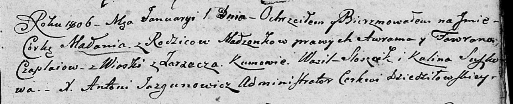

**Чапляй Маланья Аврамова (Czaplaiowna Małania)**

1 января 1806 г -- крещение (НИАБ 136-13-894, лист 59, №1/1806-р
(ориг)).

Лист 59. **Метрическая запись №1/1806-р (ориг).**

{width="6.496527777777778in"
height="1.3215660542432195in"}

Дедиловичская Покровская церковь. 1 января 1806 года. Метрическая запись
о крещении.

Czaplaiowna Małania -- дочь родителей с деревни Заречье.

Czaplay Awram -- отец.

Czaplaiowa Fawrona -- мать.

Sloszcik Wasil -- кум.

Suszkowa Kulina -- кума.

Jazgunowicz Antoni -- ксёндз.
