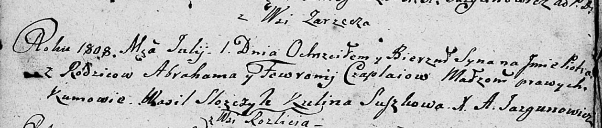

**Чапляй Пётр Аврамов (Czaplay Piotr)**

1 июля 1808 г -- крещение (НИАБ 136-13-894, лист 65об, №23/1808-р
(ориг)).

**НИАБ 136-13-894:** Лист 65об. **Метрическая запись №23/1808-р
(ориг).**

Дедиловичская Покровская церковь. 1 июля 1808 года. Метрическая запись о
крещении.

Czaplay Piotr -- сын родителей с деревни Заречье.

Czaplay Abraham -- отец.

Czaplaiowa Fewronija -- мать.

Slozczyk Wasil -- кум.

Suszkowa Kulina -- кума.

Jazgunowicz Antoni -- ксёндз.
