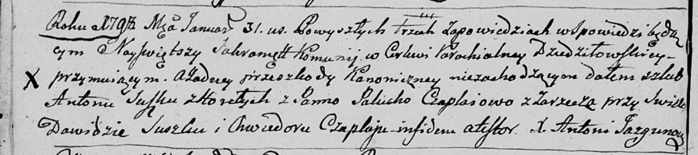
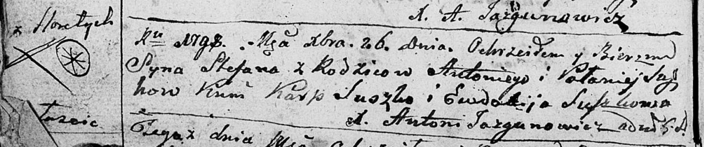
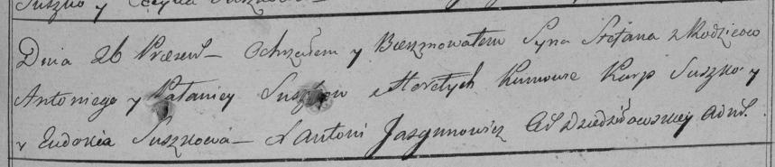
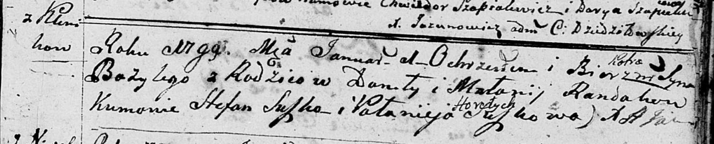
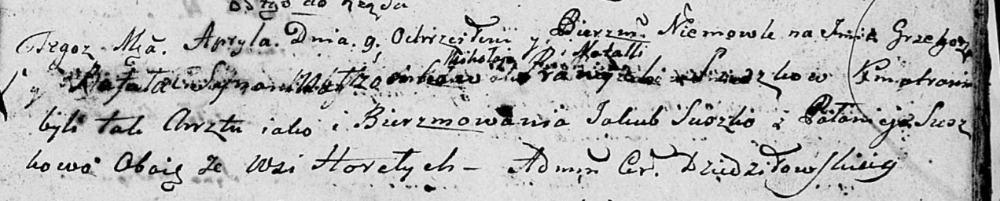
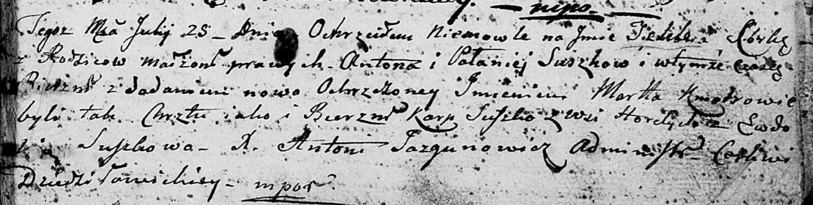

**Сушко (Чапляй) Паланея, Палюха (Suszkowa (Czaplajowa) Pałanieja,
Palucha)**

31 января 1798 г -- венчание с Антоном Сушко с деревни Горелое (НИАБ
136-13-920, лист 5об, №5/1798-б (ориг)).

26 декабря 1798 г -- крещение сына Степана (НИАБ 136-13-894, лист 37об,
№62/1798-р (ориг)), (РГИА 823-2-18, лист 267, №62/1798-р (коп)).

1 января 1799 г -- крестная мать Базыля, сына Рандаков Данилы и Маланьи
с деревни Клинники (НИАБ 136-13-894, лист 38, №1/1799-р (ориг)).

9 апреля 1800 г -- крестная мать Грыгора Рафаля, сына Сушков Миколая и
Натальи с деревни Горелое (НИАБ 136-13-894, лист 41, №13/1800-р (ориг)).

30 мая 1803 г --крестная мать Яна Игнация, сына Сушков Андрея и Марьяны
с деревни Горелое (НИАБ 136-13-894, лист 50об, №23/1803-р (ориг)).

25 июля 1804 г -- крещение дочери Текли Марты (НИАБ 136-13-894, лист 54,
№26/1804-р (ориг)).

10 апреля 1805 г --крестная мать Базыля Игнацыя, сына Поцерух Иосифа и
Зыновии с деревни Горелое (НИАБ 136-13-894, лист 57, №20/1805-р (ориг)).

**НИАБ 136-13-920:** Лист 5об. **Метрическая запись №5/1798-б (ориг).**

Дедиловичская Покровская церковь. 31 января 1798 года. Метрическая
запись о венчании.

Suszko Anton -- жених, деревня Горелое.

Czaplajowa Palucha -- невеста, деревня Заречье.

Suszko Dawid -- свидетель.

Czaplay Chwiedor -- свидетель.

Jazgunowicz Antoni -- ксёндз.

**НИАБ 136-13-894:** Лист 37об. **Метрическая запись №62/1798-р
(ориг).**

Дедиловичская Покровская церковь. 26 декабря 1798 года. Метрическая
запись о крещении.

Suszko Stefan -- сын родителей с деревни Горелое.

Suszko Antoni -- отец.

Suszkowa Pałanieja -- мать.

Suszko Karp - кум.

Suszkowa Ewdokija - кума.

Jazgunowicz Antoni -- ксёндз.

**РГИА 823-2-18:** Лист 267. **Метрическая запись №63/1798-р (коп).**

Дедиловичская Покровская церковь. 26 декабря 1798 года. Метрическая
запись о крещении.

Suszko Stefan -- сын родителей с деревни Горелое.

Suszko Antoni -- отец.

Suszkowa Pałanieja -- мать.

Suszko Karp -- кум.

Suszkowa Eudokia -- кума.

Jazgunowicz Antoni -- ксёндз.

**НИАБ 136-13-894:** Лист 38. **Метрическая запись №1/1799-р (ориг).**

Дедиловичская Покровская церковь. 1 января 1799 года. Метрическая запись
о крещении.

Randak Bazyli Piotr -- сын родителей с деревни Клинники.

Randak Daniła -- отец.

Randakowa Małanija -- мать.

Suszko Stefan - кум.

Suszkowa Pałanieja -- кума с деревни Горелое.

Jazgunowicz Antoni -- ксёндз.

**НИАБ 136-13-894:** Лист 41. **Метрическая запись №13/1800-р (ориг).**

Дедиловичская Покровская церковь. 9 апреля 1800 года. Метрическая запись
о крещении.

Suszko Grzegorz Rafal -- сын.

Suszko Mikołay -- отец.

Suszkowa Natalla -- мать.

Suszko Jakub -- кум, с деревни Горелое.

Suszkowa Pałanieja -- кума, с деревни Горелое.

Jazgunowicz Antoni -- ксёндз.

**НИАБ 136-13-894:** Лист 50об. **Метрическая запись №23/1803-р
(ориг).**

Дедиловичская Покровская церковь. 30 мая 1803 года. Метрическая запись о
крещении.

Suszko Jan Jgnacy -- сын родителей с деревни Горелое.

Suszko Andrzey -- отец.

Suszkowa Marjana -- мать.

Suszko Jakub -- кум, с деревни Горелое.

Suszkowa Pałanieja -- кума, с деревни Горелое.

Jazgunowicz Antoni -- ксёндз.

**НИАБ 136-13-894:** Лист 54. **Метрическая запись №26/1804-р (ориг).**

Дедиловичская Покровская церковь. 25 июля 1804 года. Метрическая запись
о крещении.

Suszkowna Tekla Marta -- дочь \[родителей с деревни Горелое\].

Suszko Anton -- отец.

Suszkowa Pałanieja -- мать.

Suszko Karp -- кум, с деревни Горелое.

Suszkowa Ewdokija -- кума.

Jazgunowicz Antoni -- ксёндз.

**НИАБ 136-13-894:** Лист 57. **Метрическая запись №20/1805-р (ориг).**

Дедиловичская Покровская церковь. 10 апреля 1805 года. Метрическая
запись о крещении.

Paciarucha Bazyli Jhnacy -- сын родителей с деревни Горелое.

Paciarucha Jozef -- отец.

Paciaruchowa Agata -- мать.

Suszko Jakub -- кум, с деревни Горелое.

Suszkowa Pałanieja -- кума, с деревни Горелое.

Jazgunowicz Antoni -- ксёндз.
