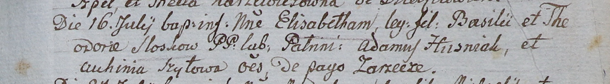

**Шило Настасья (Szyłowa Chwiedora)**

3 января 1804 г -- крестная мать у Сильвестра Антона, сына Церахов
Лаврына и Паланеи с деревни Домашковичи (НИАБ 136-13-894, лист 53,
№2/1804-р (ориг)).

**НИАБ 136-13-894:** Лист 53. **Метрическая запись №2/1804-р (ориг).**

{width="6.496527777777778in"
height="1.8566294838145232in"}

Дедиловичская Покровская церковь. 3 января 1804 года. Метрическая запись
о крещении.

Cierach Silwester Antoni -- сын родителей с деревни Домашковичи.

Cierach Ławryn -- отец.

Cierachowa Pałanieja -- мать.

Michanowicz Maciey -- кум, с деревни Заречье.

Szyłowa Chwiedora -- кума, с деревни Заречье.

Jazgunowicz Antoni -- ксёндз.
