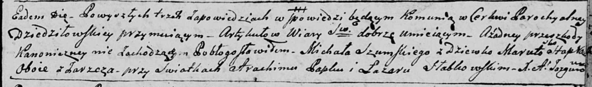
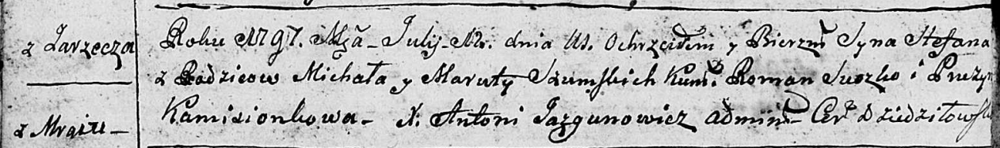
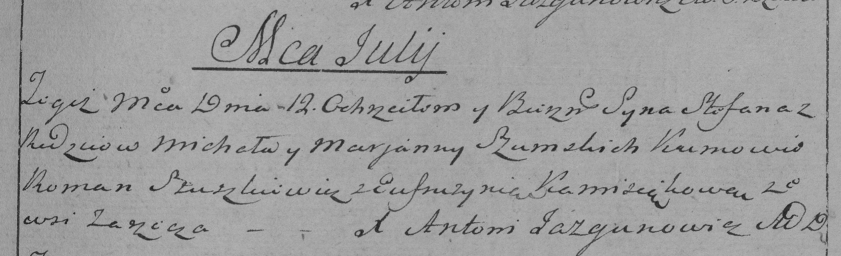
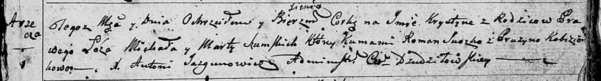
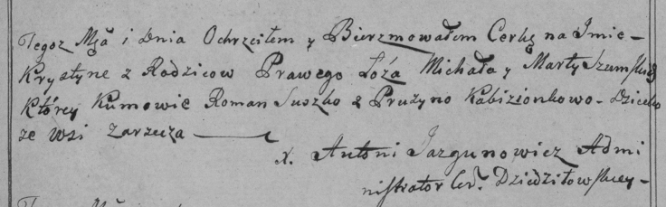
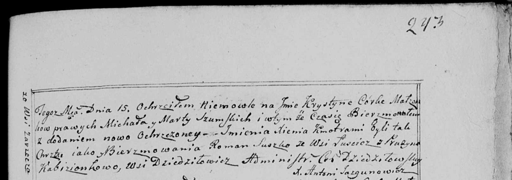
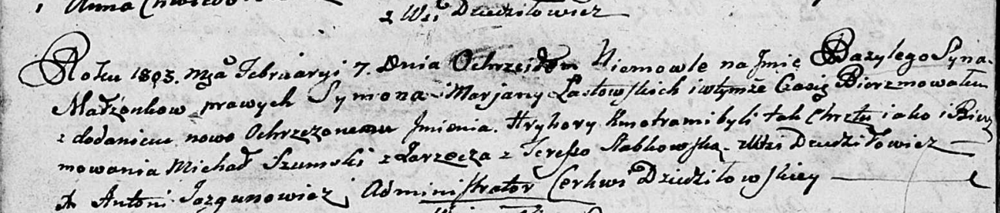

**Шумский Михал (Szumski Michał)**

10 февраля 1796 г -- венчание с девкой Марутой Слабковской с деревни
Заречье (НИАБ 136-13-920, лист 3, №5/1796-б (ориг)).

12 июля 1797 г -- крещение сына Степана (НИАБ 136-13-894, лист 33об,
№43/1797-р (ориг)), (РГИА 823-2-18, лист 260, №29/1797-р (коп)).

16 июля 1799 г -- крещение дочери Крыстыны Ксени (НИАБ 136-13-894, лист
39, №31/1799-р (ориг), РГИА 823-2-18, лист 271, №30/1799-р (коп), НИАБ
136-13-938, лист 243, №29/1799-р (коп)).

7 февраля 1803 г -- крестный отец Базыля Грыгора, сына Ластовских Сымона
и Марьяны с деревни Дедиловичи (НИАБ 136-13-894, лист 49об, №5/1803-р
(ориг)).

15 февраля 1803 г -- крещение дочери Евы Магдалены (НИАБ 136-13-894,
лист 49об, №9/1803-р (ориг)).

**НИАБ 136-13-920:** Лист 3. **Метрическая запись №5/1796-б (ориг).**

Дедиловичская Покровская церковь. 10 февраля 1796 года. Метрическая
запись о венчании.

Szumski Michał -- жених, деревня Заречье.

Słapkowska Maruta -- невеста, девка, деревня Заречье.

Papko Atrachim -- свидетель.

Słabkowski Łazar -- свидетель.

Jazgunowicz Antoni -- ксёндз.

**НИАБ 136-13-894:** Лист 33об. **Метрическая запись №43/1797-р
(ориг).**

Дедиловичская Покровская церковь. 12 июля 1797 года. Метрическая запись
о крещении.

Szumski Stefan -- сын родителей с деревни Заречье (Мрай).

Szumski Michał -- отец.

Szumska Maruta -- мать.

Suszko Roman - кум.

Kamisionkowa Pruzyna - кума.

Jazgunowicz Antoni -- ксёндз.

**РГИА 823-2-18:** Лист 260. **Метрическая запись №29/1797-р (коп).**

Дедиловичская Покровская церковь. 12 июля 1797 года. Метрическая запись
о крещении.

Szumski Stefan -- сын родителей с деревни Заречье.

Szumski Michał -- отец.

Szumska Marjanna -- мать.

Szuszkiewicz \[Suszko\] Roman -- кум.

Kamisiąkowa Eufrusynia -- кума.

Jazgunowicz Antoni -- ксёндз.

**НИАБ 136-13-894:** Лист 39. **Метрическая запись №31/1799-р (ориг).**

Дедиловичская Покровская церковь. 16 июля 1799 года. Метрическая запись
о крещении.

Szumska Krystyna Xienia -- дочь родителей с деревни Заречье.

Szumski Michał -- отец.

Szumska Marta -- мать.

Suszko Roman -- кум.

Kobizionkowa Pruzyna -- кума.

Jazgunowicz Antoni -- ксёндз.

**РГИА 823-2-18:** Лист 271. **Метрическая запись №30/1799-р (коп).**

Дедиловичская Покровская церковь. \[16 июля\] 1799 года. Метрическая
запись о крещении.

Szumska Krystyna -- дочь родителей с деревни Заречье.

Szumski Michał -- отец.

Szumska Marta -- мать.

Suszko Roman -- кум.

Kabizionkowa Krystyna -- кума.

Jazgunowicz Antoni -- ксёндз.

**НИАБ 136-13-938:** Лист 243. **Метрическая запись №29/1799-р (коп).**

(См. тж. НИАБ 136-13-894, лист 39, №31/1799-р (ориг); РГИА 823-2-18,
лист 271, №30/1799-р (коп))

Дедиловичская Покровская церковь. 15 августа 1799 года. Метрическая
запись о крещении.

Szumska Krystyna Xienia -- дочь родителей с деревни Заречье.

Szumski Michał -- отец.

Szumska Marta -- мать.

Suszko Roman -- кум, c деревни Лустичи.

Kabizionkowa Pruzyna - кума, с деревни Дедиловичи.

Jazgunowicz Antoni -- ксёндз.

**НИАБ 136-13-894:** Лист 49об. **Метрическая запись №5/1803-р (ориг).**

Дедиловичская Покровская церковь. 7 февраля 1803 года. Метрическая
запись о крещении.

Łastowski Bazyli Hryhory -- сын родителей с деревни Дедиловичи.

Łastowski Symon -- отец.

Łastowska Marjana -- мать.

Szumski Michał -- кум, с деревни Заречье.

Slabkowska Teresia -- кума, с деревни Дедиловичи.

Jazgunowicz Antoni -- ксёндз.

**НИАБ 136-13-894:** Лист 49об. **Метрическая запись №9/1803-р (ориг).**

Дедиловичская Покровская церковь. 15 февраля 1803 года. Метрическая
запись о крещении.

Szumska Ewa Magdalena -- дочь родителей с деревни Заречье.

Szumski Michał -- отец.

Szumska Marjana -- мать.

Suszko Łukjan -- кум, с деревни Горелое.

Kamisionkowa Fruzyna -- кума, с деревни Дедиловичи.

Jazgunowicz Antoni -- ксёндз.
