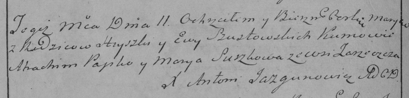

**Шустовский Грышка (Susztowski Hryszka)**

11 апреля 1786 г -- крещение дочери Марыи (РГИА 836-2-18, лист 321об,
№12/1796-р (коп)).

**РГИА 823-2-18:** Лист 231об. **Метрическая запись №12/1786-р (коп).**

{width="6.496527777777778in"
height="1.5625in"}

Дедиловичская Покровская церковь. 11 апреля 1786 года. Метрическая
запись о крещении.

Szustowska Marya -- дочь родителей с деревни Заречье.

Szustowski Hryszka -- отец.

Szustowska Ewa -- мать.

Papko Atrachim -- кум.

Suszkowa Marya - кума.

Jazgunowicz Antoni -- ксёндз.
