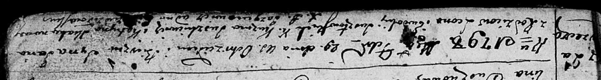
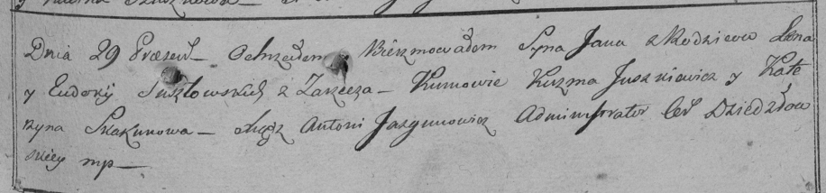

**Шустовский Ян Леонов (Susztowski Jan Antoni)**

29 февраля 1798 г -- крещение (НИАБ 136-13-894, лист 35, №7/1798-р
(ориг)), (РГИА 823-2-18, лист 262, №6/1798-р (коп)).

**НИАБ 136-13-894:** Лист 35. **Метрическая запись №7/1798-р (ориг).**

Дедиловичская Покровская церковь. 29 февраля 1798 года. Метрическая
запись о крещении.

Susztowski Jan -- сын родителей с деревни Заречье.

Susztowski Leon -- отец.

Susztowska Ewdokija -- мать.

Juszkiewicz Kuźma - кум.

Skakunowa Katryna - кума.

Jazgunowicz Antoni -- ксёндз.

**РГИА 823-2-18:** Лист 262. **Метрическая запись №7/1798-р (коп).**

Дедиловичская Покровская церковь. 29 февраля 1798 года. Метрическая
запись о крещении.

Susztowski Jan Antoni -- сын родителей с деревни Заречье.

Susztowski Leon -- отец.

Susztowska Eudokija -- мать.

Juszkiewicz Kuzma -- кум.

Skakunowa Katerzyna -- кума.

Jazgunowicz Antoni -- ксёндз.
