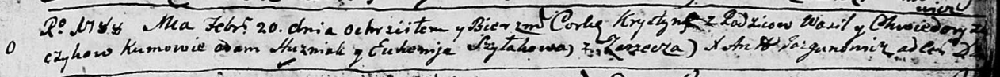

**Хрыстына Василева (\...czykowna Krystyna)**

20 февраля 1787 г -- крещение (НИАБ 136-13-894, лист 4, №23/1788-р
(ориг)).

**НИАБ 136-13-894:** Лист 4. **Метрическая запись №23/1788-р (ориг).**

Дедиловичская Покровская церковь. 20 февраля 1788 года. Метрическая
запись о крещении.

\...czykowna Krystyna -- дочь родителей с деревни Заречье.

\...czyk Wasil -- отец.

\...czykowa Chwiedora -- мать.

Huzniak Adam - кум.

Szyłakowa Euhenija - кума.

Jazgunowicz Antoniusz -- ксёндз.
