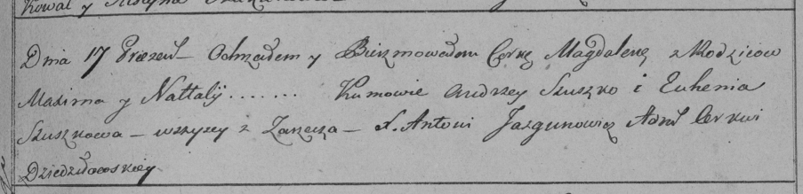

**Магдалена Максимова (Magdalena)**

17 января 1798 г -- крещение (НИАБ 136-13-894, лист 35, №3/1798-р
(ориг)), (РГИА 823-2-18, лист 262, №2/1798-р (коп)).

**НИАБ 136-13-894:** Лист 35. **Метрическая запись №2/1798-р (ориг).**

{width="6.496527777777778in"
height="1.0392836832895889in"}

Дедиловичская Покровская церковь. 17 января 1798 года. Метрическая
запись о крещении.

Magdalena -- дочь родителей с деревни Заречье.

Maxim -- отец.

Natalla -- мать.

Suszko Andrzey - кум.

Suszkowa Euhenija - кума.

Jazgunowicz Antoni -- ксёндз.

**РГИА 823-2-18:** Лист 262. **Метрическая запись №2/1798-р (коп).**

{width="6.496527777777778in"
height="1.5756944444444445in"}

Дедиловичская Покровская церковь. 17 января 1798 года. Метрическая
запись о крещении.

Magdalena -- дочь родителей с деревни Заречье.

Maxim -- отец.

Natalla -- мать.

Szuszko Andrzey -- кум, с деревни Заречье.

Szuszkowa Euhenija -- кума, с деревни Заречье.

Jazgunowicz Antoni -- ксёндз.
