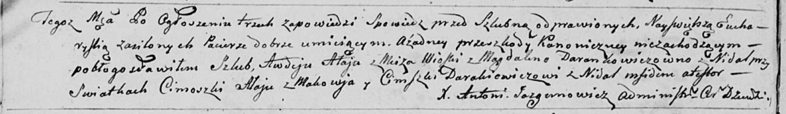

**Алай Цимошка (Ałay Cimoszka)**

6 ноября 1799 г -- свидетель венчания Авдея Алая с деревни Мстиж с
Магдаленой Дранкович с деревни Недаль (НИАБ 136-13-920, лист 6об,
№5/1799-б (ориг)).

**НИАБ 136-13-894:** Лист 6об. **Метрическая запись №5/1799-б (ориг).**

Дедиловичская Покровская церковь. 6 ноября 1799 года. Метрическая запись
о венчании.

Ałay Awdey -- жених, деревня Мстиж.

Darankowiczowna Magdalena -- невеста, деревня Недаль.

Ałay Cimoszka -- свидетель, деревня Маковье.

Darakiewicz Cimoszka -- свидетель, деревня Нидаль.

Jazgunowicz Antoni -- ксёндз.
