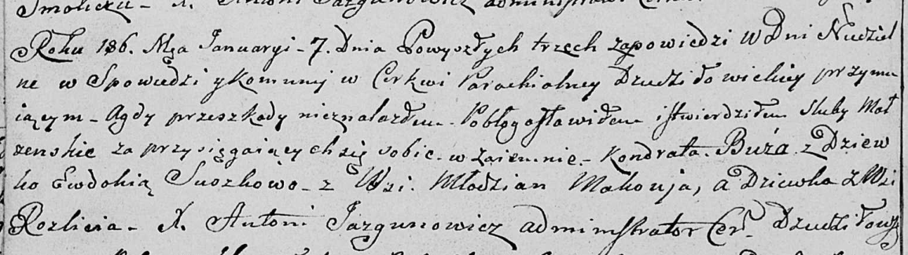

**Буза Кондрат (Buza Kondrat)**

7 января 1806 г -- венчание с девкой Евдокией Сушко с деревни Разлитье
(НИАБ 136-13-920, лист 11об, №1/1806-б (ориг)).

**НИАБ 136-13-920:** Лист 11об. **Метрическая запись №1/1806-б (ориг).**

Дедиловичская Покровская церковь. 7 января 1806 года. Метрическая запись
о венчании.

Buza Kondrat -- жених, с деревни Маковье.

Suszkowna Ewdokia -- невеста, девка, с деревни Разлитье.

Jazgunowicz Antoni -- ксёндз.
