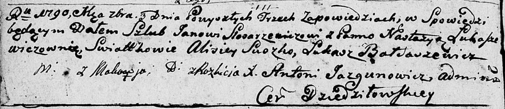

**Слесаревич (Лукашевич) Настасья (Slosarzewiczowa Nastazya z
Łukaszewiczow)**

3 сентября 1790 г -- венчание с Яном Слесаревичем с деревни Маковье
(НИАБ 136-13-894, лист 68об, №7/1790-б (ориг)).

**НИАБ 136-13-894:** Лист 68об. **Метрическая запись №7/1790-б (ориг).**

{width="6.496527777777778in"
height="1.40336832895888in"}

Дедиловичская Покровская церковь. 3 сентября 1790 года. Метрическая
запись о венчании.

Slosarzewicz Jan -- жених, с деревни Маковье.

Łukaszewiczowna Nastazya -- невеста, с деревни Разлитье.

Suszko Alisiey -- свидетель.

Bardaszewicz Łukasz -- свидетель.

Szyło Jan -- свидетель.

Szyło Leon -- свидетель.

Jazgunowicz Antoni -- ксёндз.
