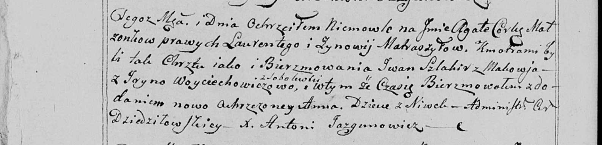

**Шляхир Иван (Szlahir Jwan)**

10 февраля 1799 г -- крестный отец Агаты, дочери Матрашилов Лаврына и
Зиновии с деревни Нивки (НИАБ 136-13-938, лист 240об, №7/1799-р (коп)).

**НИАБ 136-13-938:** Лист 240об. **Метрическая запись №7/1799-р (коп).**

(См. тж. НИАБ 136-13-894, лист 38, №7/1799-р (ориг); РГИА 823-2-18, лист
268, №7/1799-р (коп))

Дедиловичская Покровская церковь. 10 февраля 1799 года. Метрическая
запись о крещении.

Matraszyłowa Agata Anna -- дочь родителей с деревни Нивки.

Matraszyło Łaurenty -- отец.

Matraszyłowa Zynowija -- мать.

Szlahir Jwan -- кум, с деревни Маковье.

Woyciechowiczowa Jryna - кума, с деревни Соболевка.

Jazgunowicz Antoni -- ксёндз.
