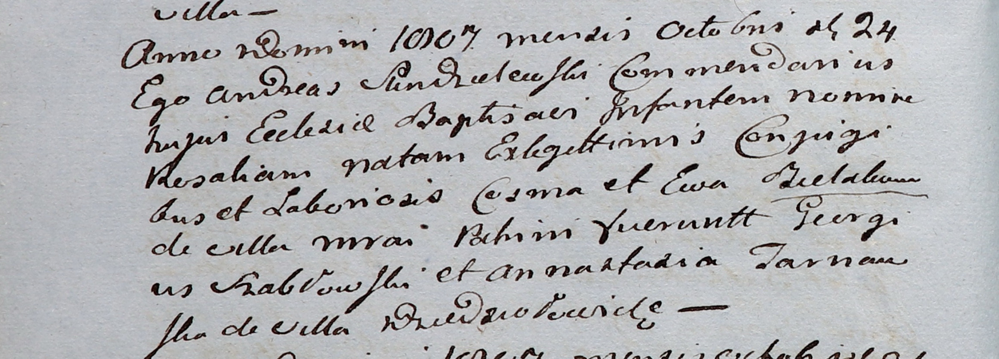

**Беляк Розалия Космина (Bielakowna Rosalia)**

24 октября 1807 г -- крещение (НИАБ 937-4-32, лист 16об, №21/1807-р).

**НИАБ 937-4-32:** Лист 16об. **Метрическая запись №21/1807-р.**

{width="6.496527777777778in"
height="2.3354166666666667in"}

Дедиловичский костел Наисвятейшего Сердца Иисуса. 24 октября 1807 года.
Метрическая запись о крещении.

Bielakowna Rosalia -- дочь крестьян с деревни Мрай.

Bielak Cosma -- отец.

Bielakowa Ewa -- мать.

Szabłowski Georgius -- крестный отец.

Tarnowska Annastazia -- крестная мать, с деревни Дедиловичи.

Scindzelewski Andreas -- ксёндз, викарий Дедиловичский.
