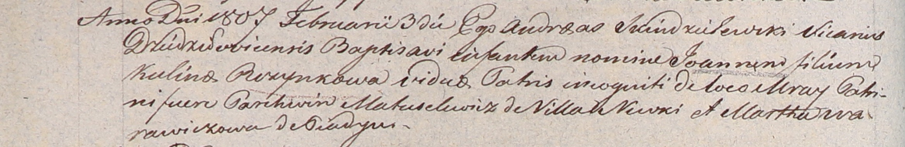

**Пузынко Иоанн (Puzynko Joann)**

3 февраля 1807 г -- крещение (НИАБ 937-4-32, лист 14об, №4/1807-б).

**НИАБ 937-4-32:** Лист 14об. **Метрическая запись №4/1807-р.**

Дедиловичский костел Наисвятейшего Сердца Иисуса. 3 февраля 1807 года.
Метрическая запись о крещении.

Puzynko Joann -- незаконнорожденный сын.

Puzynkowa Kulina -- мать, с застенка Мрай.

Matuselewicz Parchwien -- крестный отец, с деревни Нивки.

Warawiczowa -- крестная мать, с деревни Пядань.

Skindzelewski Andreas -- ксёндз, викарий Дедиловичский.
