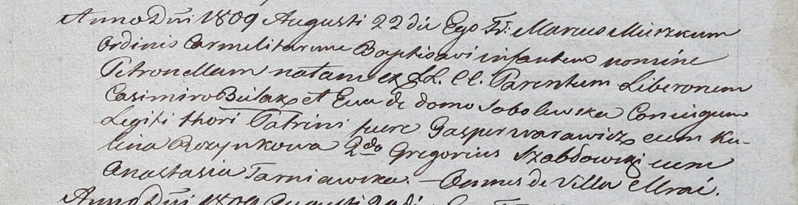

**Пузынко Кулина (Puzynkowa Kulina)**

3 февраля 1807 г -- крещение незаконнорожденного сына Иоанна (НИАБ
937-4-32, лист 14об, №4/1807-б).

22 августа 1809 г -- крестная мать Петронели, дочери Космы и Евы Беляков
с деревни Мрай (НИАБ 937-4-32, лист 20, №24/1809-р).

**НИАБ 937-4-32:** Лист 14об. **Метрическая запись №4/1807-р.**

Дедиловичский костел Наисвятейшего Сердца Иисуса. 3 февраля 1807 года.
Метрическая запись о крещении.

Puzynko Joann -- незаконнорожденный сын.

Puzynkowa Kulina -- мать, с застенка Мрай.

Matuselewicz Parchwien -- крестный отец, с деревни Нивки.

Warawiczowa -- крестная мать, с деревни Пядань.

Skindzelewski Andreas -- ксёндз, викарий Дедиловичский.

**НИАБ 937-4-32:** Лист 20. **Метрическая запись №24/1809-р.**

Дедиловичский костел Наисвятейшего Сердца Иисуса. 22 августа 1809 года.
Метрическая запись о крещении.

Bielakowna Petronella -- дочь вольных людей с деревни Мрай.

Bielako Casimir -- отец.

Bielakowa Eva z Sobolewskich -- мать.

Warawicz Gasper -- крестный отец, с деревни Мрай.

Puzynkowa Kulina -- крестная мать, с деревни Мрай.

Szabłowski Gregori - ассистент, с деревни Мрай.

Tarniawska Anastasia - ассистентка, с деревни Мрай.

Miszkun Marcus -- ксёндз.
