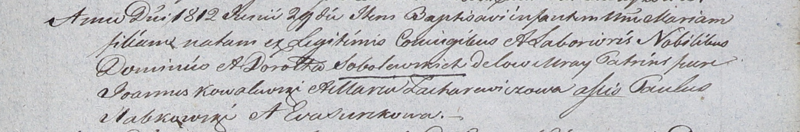

**Соболевская Мария Доминикова (Sobolewska Maria)**

29 июня 1812 г -- крещение (НИАБ 937-4-32, лист 25, №17/1812-р).

**НИАБ 937-4-32:** Лист 25. **Метрическая запись №17/1812-р.**

{width="6.496527777777778in"
height="1.0805555555555555in"}

Дедиловичский костел Наисвятейшего Сердца Иисуса. 29 июня 1812 года.
Метрическая запись о крещении.

Sobolewska Maria -- дочь родителей с застенка Мрай.

Sobolewski Dominic -- отец.

Sobolewska Maria -- мать.

Kowalewski Joann -- крестный отец.

Zacharewiczowa Maria -- крестная мать.

Słabkowski Paulus - ассистент.

Surzkowa Eva - ассистентка.

Zychowski Gabriel -- ксёндз.
