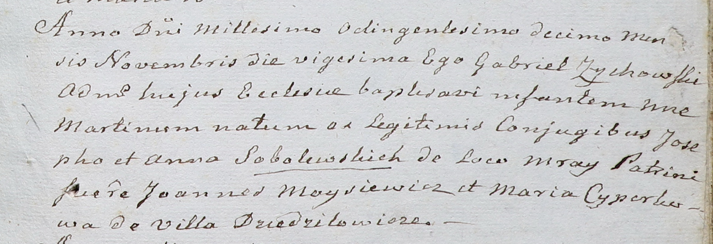

**Соболевский Мартин Иосифов (Sobolewski Martin)**

20 ноября 1810 г -- крещение (НИАБ 937-4-32, лист 22, №18/1810-р).

**НИАБ 937-4-32:** Лист 22. **Метрическая запись №18/1810-р.**

Дедиловичский костел Наисвятейшего Сердца Иисуса. 20 ноября 1810 года.
Метрическая запись о крещении.

Sobolewski Martin -- сын родителей с застенка Мрай.

Sobolewski Joseph -- отец.

Sobolewska Anna -- мать.

Moysiewicz Joann -- крестный отец.

Cyperkowa Maria -- крестная мать, с деревни Дедиловичи.

Zychowski Gabriel -- ксёндз.
