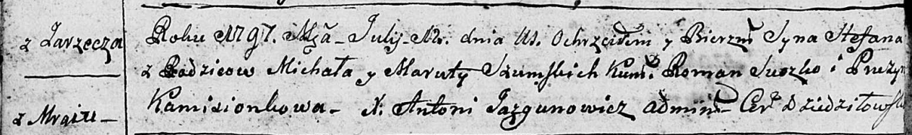

**Шумская Марута (Szumska Maruta)**

12 июля 1797 г -- крещение сына Степана (НИАБ 136-13-894, лист 33об,
№43/1797-р (ориг)).

**НИАБ 136-13-894:** Лист 33об. **Метрическая запись №43/1797-р
(ориг).**

Дедиловичская Покровская церковь. 12 июля 1797 года. Метрическая запись
о крещении.

Szumski Stefan -- сын родителей с деревни Заречье (Мрай).

Szumski Michał -- отец.

Szumska Maruta -- мать.

Suszko Roman - кум.

Kamisionkowa Pruzyna - кума.

Jazgunowicz Antoni -- ксёндз.
