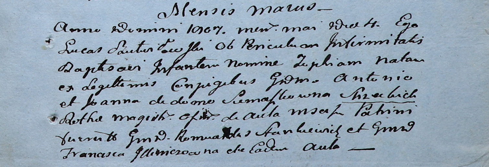

**Иллинич Франциска (Jlliniczowna Francisca)**

4 мая 1807 г -- крестная мать Софии, дочери Антона и Иоанна Стизецких со
двора Мстиж (НИАБ 937-4-32, лист 15, №8/1807-р).

**НИАБ 937-4-32:** Лист 15. **Метрическая запись №8/1807-р.**

Дедиловичский костел Наисвятейшего Сердца Иисуса. 4 мая 1807 года.
Метрическая запись о крещении.

Suzecka? Zophia -- дочь шляхтичей со двора Мстиж.

Suzecki? Antoni -- отец.

Suzecka? Joanna z Siemaszkow -- мать.

Stankiewicz Romualdus -- крестный отец, шляхтич, со двора Мстиж.

Jlliniczowna Francisca -- крестная мать, шляхтянка, со двора Мстиж.

Butwiłowski Łucas -- ксёндз.
