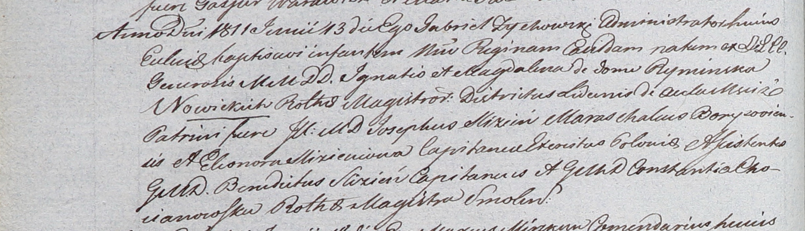

**Новицкая Регина Игнатьева (Nowicka Regina)**

13 июня 1811 г -- крещение (НИАБ 937-4-32, лист 23об, №12/1811-р).

**НИАБ 937-4-32:** Лист 23об. **Метрическая запись №12/1811-р.**

Дедиловичский костел Наисвятейшего Сердца Иисуса. 13 июня 1811 года.
Метрическая запись о крещении.

Nowicka Regina -- дочь шляхтичей со двора Мстиж.

Nowicki Jgnatis -- отец, ротмистр ?.

Nowicka Magdalena z Ryminskich -- мать.

Slizień Joseph -- крестный отец, шляхтич, маршалок Борисовский, со двора
Мстиж.

Slizieniowna Eleonora -- крестная мать, шляхтянка, капитанша.

Slizień Benedictus - ассистент, шляхтич, капитан.

Chocianowska Constantia - ассистентка, шляхтянка, ротмистрша Смоленская.

Zychowski Gabriel -- ксёндз.
