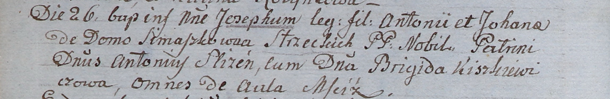

**Слизень Антон (Slizień Fytoni)**

26 марта 1805 г -- крестный отец Иосифа, сына Антона и Иоханы Стизецких
со двора Мстиж (НИАБ 937-4-32, лист 11об, №13/1805-р).

**НИАБ 937-4-32:** Лист 11об. **Метрическая запись №13/1805-р.**

Дедиловичский костел Наисвятейшего Сердца Иисуса. 26 марта 1805 года.
Метрическая запись о крещении.

Stizecki Joseph -- сын шляхтичей со двора Мстиж.

Stizecki Antoni -- отец.

Stizecka Johana z Simaszkow -- мать.

Slizien Antoni -- крестный отец, шляхтич, со двора Мстиж.

Kiszkiewiczowa Brigida -- крестная мать, шляхтянка, со двора Мстиж.

Linhart Hiacinthus -- ксёндз.
