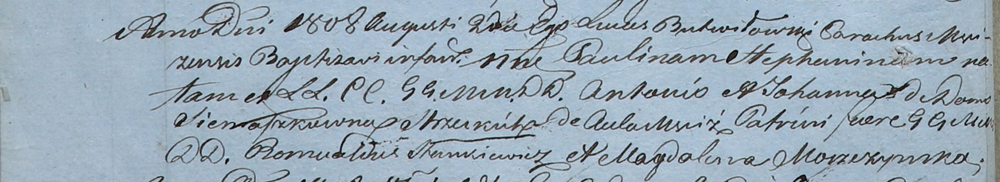
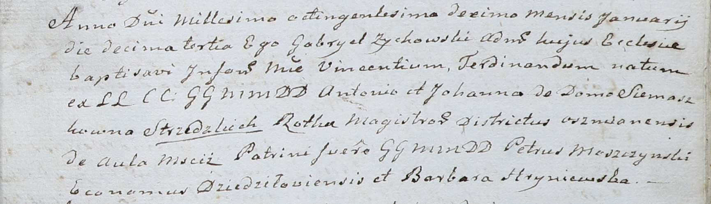

**Стизецкий Антон (Stizecki, Suzecki, Strzecki, Strzedzki Antoni)**

26 марта 1805 г -- крещение сына Иосифа (НИАБ 937-4-32, лист 11об,
№13/1805-р).

4 мая 1807 г -- крещение дочери Софии (НИАБ 937-4-32, лист 15,
№8/1807-р).

2 августа 1808 г -- крещение дочери Павлины Стефанины (НИАБ 937-4-32,
лист 18об, №23/1808-р).

13 января 1810 г -- крещение сына Винцентия Фердинанда (НИАБ 937-4-32,
лист 21, №3/1810-р).

**НИАБ 937-4-32:** Лист 11об. **Метрическая запись №13/1805-р.**

Дедиловичский костел Наисвятейшего Сердца Иисуса. 26 марта 1805 года.
Метрическая запись о крещении.

Stizecki Joseph -- сын шляхтичей со двора Мстиж.

Stizecki Antoni -- отец.

Stizecka Johana z Simaszkow -- мать.

Slizien Antoni -- крестный отец, шляхтич, со двора Мстиж.

Kiszkiewiczowa Brigida -- крестная мать, шляхтянка, со двора Мстиж.

Linhart Hiacinthus -- ксёндз.

**НИАБ 937-4-32:** Лист 15. **Метрическая запись №8/1807-р.**

Дедиловичский костел Наисвятейшего Сердца Иисуса. 4 мая 1807 года.
Метрическая запись о крещении.

Suzecka? Zophia -- дочь шляхтичей со двора Мстиж.

Suzecki? Antoni -- отец.

Suzecka? Joanna z Siemaszkow -- мать.

Stankiewicz Romualdus -- крестный отец, шляхтич, со двора Мстиж.

Jlliniczowna Francisca -- крестная мать, шляхтянка, со двора Мстиж.

Butwiłowski Łucas -- ксёндз.

**НИАБ 937-4-32:** Лист 18об. **Метрическая запись №23/1808-р.**

Дедиловичский костел Наисвятейшего Сердца Иисуса. 2 августа 1808 года.
Метрическая запись о крещении.

Strzecka Paulina Stephanina -- дочь шляхтичей со двора Мстиж.

Strzecki Antoni -- отец.

Strzecka Johanna z Siemaszkow -- мать.

Stankiewicz Romualdus -- крестный отец, шляхтич.

Moszczynska Magdalena -- крестная мать, шляхтянка.

Butwiłowski Łukas -- ксёндз, администратор Мстижский.

**НИАБ 937-4-32:** Лист 21. **Метрическая запись №3/1810-р.**

Дедиловичский костел Наисвятейшего Сердца Иисуса. 13 января 1810 года.
Метрическая запись о крещении.

Strzedzki Vincenti Ferdinand -- сын шляхтичей со двора Мстиж.

Strzedzki Antoni -- отец, ротмистр Ошмянский.

Strzedzka Johanna z Siemaszkow -- мать.

Moszczynski Petrus -- крестный отец, шляхтич, эконом Дедиловичский.

Hryniewska Barbara -- крестная мать.

Zychowski Gabriel -- ксёндз.
