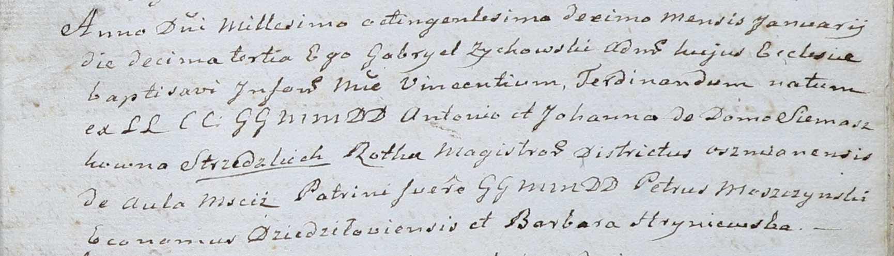

**Стизецкий Винцентий Антонов (Strzedzki Vincenti Ferdinand)**

13 января 1810 г -- крещение (НИАБ 937-4-32, лист 21, №3/1810-р).

**НИАБ 937-4-32:** Лист 21. **Метрическая запись №3/1810-р.**

{width="6.496527777777778in"
height="1.8701388888888888in"}

Дедиловичский костел Наисвятейшего Сердца Иисуса. 13 января 1810 года.
Метрическая запись о крещении.

Strzedzki Vincenti Ferdinand -- сын шляхтичей со двора Мстиж.

Strzedzki Antoni -- отец, ротмистр Ошмянский.

Strzedzka Johanna z Siemaszkow -- мать.

Moszczynski Petrus -- крестный отец, шляхтич, эконом Дедиловичский.

Hryniewska Barbara -- крестная мать.

Zychowski Gabriel -- ксёндз.
