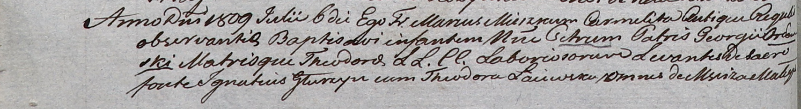

**Глушень Игнатий (Głurzyn Jgnati)**

6 июля 1809 -- крестный отец Петра, сына Георгия и Теодоры Орловских с
деревни Мстиж (НИАБ 937-4-32, лист 19об, №20/1809-р).

**НИАБ 937-4-32:** Лист 19об. **Метрическая запись №20/1809-р.**

Дедиловичский костел Наисвятейшего Сердца Иисуса. 6 июля 1809 года.
Метрическая запись о крещении.

Orłowski Petrus -- сын крестьян с деревни Мстиж.

Orłowski Georgi -- отец.

Orłowska Theodora -- мать.

Głurzyn Jgnati -- крестный отец, с деревни Мстиж.

Łaiewska Theodora -- крестная мать, с деревни Мстиж.

Miszkun Marcus -- ксёндз.
