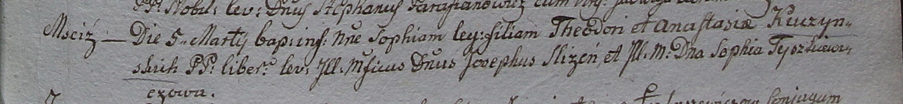

**Кучинская Анастасия (Kuczynska Anastasia)**

5 марта 1799 г -- крещение дочери Софии (НИАБ 1781-27-199, лист 125,
№18/1799-р).

**НИАБ 1781-27-199:** Лист 125. **Метрическая запись №18/1799-р.**

Дедиловичский костел Наисвятейшего Сердца Иисуса. 5 марта 1799 года.
Метрическая запись о крещении.

Kuczynska Sophia -- дочь крестьян с деревни Мстиж.

Kuczynski Theodor -- отец.

Kuczynska Anastasia -- мать.

Slizień Joseph -- крестный отец, шляхтич, владелец Мстижа.

Tyszkiewiczowa Sophia - крестная мать, шляхтянка.

Linhart Hyacinthus -- ксёндз.
