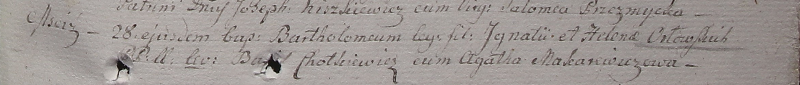

**Орловская Елена (Orłowska Helena)**

28 августа 1799 г -- крещение сына Бартоломея (НИАБ 1781-27-199, лист
128, №38/1799-р).

17 сентября 1799 г -- отпевание, умерла в возрасте 23 лет (родилась
около 1776 г) (НИАБ 1781-27-199, лист 131, №16/1799-у).

**НИАБ 1781-27-199:** Лист 128. **Метрическая запись №38/1799-р.** (см.
тж. лист 129. №39/1799-р)

Дедиловичский костел Наисвятейшего Сердца Иисуса. 28 августа 1799 года.
Метрическая запись о крещении.

Orłowski Bartołomei -- сын крестьян с деревни Мстиж.

Orłowski Jgnati -- отец.

Orłowska Helena -- мать.

Chotkiewicz Basil -- крестный отец.

Makarewiczowa Agatha -- крестная мать.

Linhart Hyacinthus -- ксёндз.

**НИАБ 1781-27-199:** Лист 129. **Метрическая запись №39/1799-р.** (см.
тж. Лист 128. **Метрическая запись №38/1799-р**)

Дедиловичский костел Наисвятейшего Сердца Иисуса. 1 сентября 1799 года.
Метрическая запись о крещении.

Orłowski Bartołomeum -- сын крестьян с деревни Мстиж.

Orłowski Jgnati -- отец.

Orłowska Helena -- мать.

Chotkiewicz Basil -- крестный отец.

Makarewiczowa Agatha -- крестная мать.

Linhart Hyacinthus -- ксёндз.

**НИАБ 1781-27-199:** Лист 131. **Метрическая запись №16/1799-у.**

Дедиловичский костел Наисвятейшего Сердца Иисуса. 17 сентября 1799 года.
Метрическая запись об отпевании.

Orłowska Helena -- умершая, 23 года, с деревни Мстиж.

Linhart Hyacinthus -- ксёндз.
