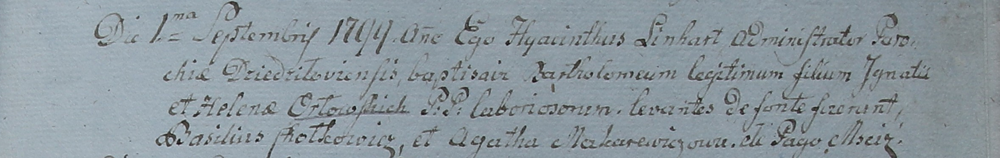

**Орловский Игнаты (Orłowski Jgnati)**

28 августа 1799 г -- крещение сына Бартоломея (НИАБ 1781-27-199, лист
128, №38/1799-р).

**НИАБ 1781-27-199:** Лист 128. **Метрическая запись №38/1799-р.** (см.
тж. лист 129. №39/1799-р)

{width="6.496527777777778in"
height="0.7013888888888888in"}

Дедиловичский костел Наисвятейшего Сердца Иисуса. 28 августа 1799 года.
Метрическая запись о крещении.

Orłowski Bartołomei -- сын крестьян с деревни Мстиж.

Orłowski Jgnati -- отец.

Orłowska Helena -- мать.

Chotkiewicz Basil -- крестный отец.

Makarewiczowa Agatha -- крестная мать.

Linhart Hyacinthus -- ксёндз.

**НИАБ 1781-27-199:** Лист 129. **Метрическая запись №39/1799-р.** (см.
тж. Лист 128. **Метрическая запись №38/1799-р**)

{width="6.496527777777778in"
height="1.0319444444444446in"}

Дедиловичский костел Наисвятейшего Сердца Иисуса. 1 сентября 1799 года.
Метрическая запись о крещении.

Orłowski Bartołomeum -- сын крестьян с деревни Мстиж.

Orłowski Jgnati -- отец.

Orłowska Helena -- мать.

Chotkiewicz Basil -- крестный отец.

Makarewiczowa Agatha -- крестная мать.

Linhart Hyacinthus -- ксёндз.
