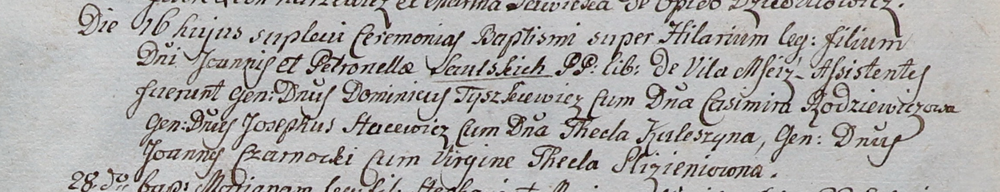

**Саульский Гилярий Иоаннов (Saulski Hilari)**

16 сентября 1800 г -- крещение (НИАБ 937-4-32, лист 3, №29/1800-р).

**НИАБ 937-4-32:** Лист 3. **Метрическая запись №29/1800-р.**

{width="6.496527777777778in"
height="1.2479166666666666in"}

Дедиловичский костел Наисвятейшего Сердца Иисуса. 16 сентября 1800 года.
Метрическая запись о крещении.

Saulski Hilari -- сын вольных людей с деревни Мстиж.

Saulski Joann -- отец.

Saulska Petronella -- мать.

Tyszkiewicz Dominic -- крестный отец, шляхтич.

Rodzewiczowa Casimira -- крестная мать, шляхтянка.

Stacewicz Josiph - ассистент, шляхтич.

Kuleszina Thecla - ассистентка, шляхтянка.

Czarnocki Joann - ассистент, шляхтич.

Slizieniowna Thecla - ассистентка, шляхтянка, девица.

Linhart Hyacinthus -- ксёндз.
