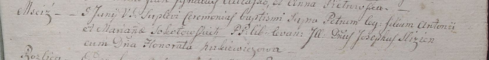

**Соколовская Петра Антониева (Sokołowska Petra?)**

5 июня 1799 г -- крещение (НИАБ 1781-27-199, лист 128, №28/1799-р).

**НИАБ 1781-27-199:** Лист 128. **Метрическая запись №28/1799-р.**

Дедиловичский костел Наисвятейшего Сердца Иисуса. 5 июня 1799 года.
Метрическая запись о крещении.

Sokołowska Petra? -- дочь крестьян с деревни Мстиж.

Sokołowski Antoni -- отец.

Sokołowska Mariana -- мать.

Slizień Joseph -- крестный отец, шляхтич.

Kirkiewiczowa Honoratha -- крестная мать, шляхтянка.

Linhart Hyacinthus -- ксёндз.
